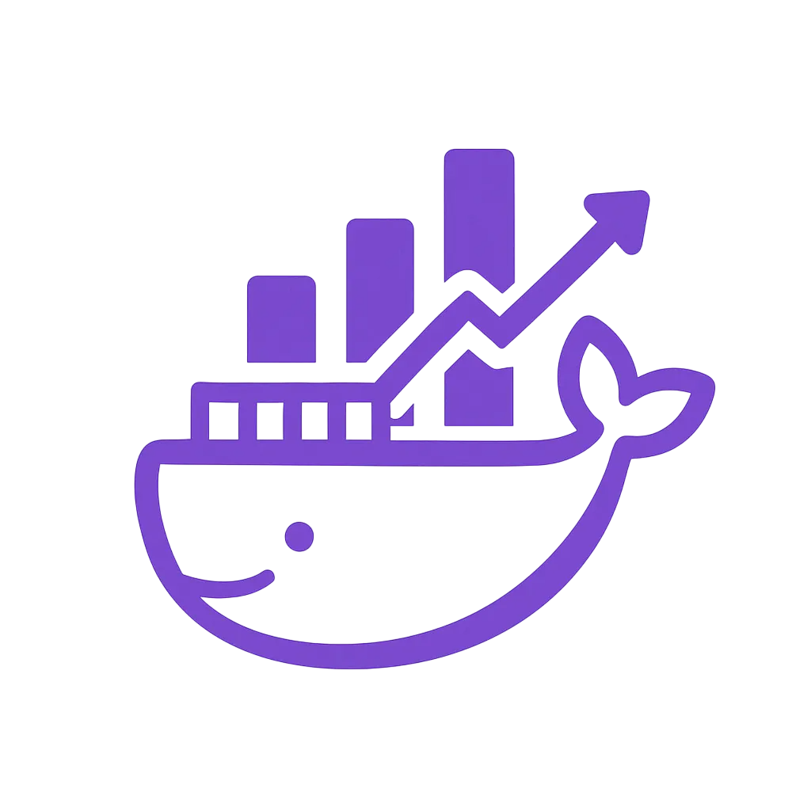

<div align="center">
  
</div>

# Docker Monitor

**Docker Monitor** is a lightweight and responsive web application for real-time monitoring of Docker container resource usage.

It displays **CPU and RAM consumption** per container in a simple, visual interface, allowing you to switch between table view and several types of charts (bar, line, and pie).

---

## 🚀 Features

- 🟢 Real-time container monitoring
- 📊 Multiple visualization modes:
  - **Table View:** Detailed metrics with progress bars.
  - **History Chart:** Inline CPU/RAM history for individual containers (Line/Bar, Zoom/Pan).
  - **Comparison Charts:** Dedicated pages comparing Top N containers by CPU/RAM Usage or Uptime.
- 📄 View container **logs** directly from the UI
- ⚖️ **Comparison Charts:** Compare Top N containers by CPU/RAM Usage or Uptime on dedicated pages.
- 🧠 **Filtering & Sorting:**
  - **Filters:** By Name (main filter & navbar search), Status, and Docker Compose Project.
  - **Sorting:** Clickable table headers to sort by Name, CPU, RAM, Procs, Status, Uptime, Restarts, Mem Limit, Net I/O, Block I/O, or Update Availability. Ascending/Descending control.
- 🔍 **Navbar Search:** Quick filter containers by name from the header.
- 🏗️ **Project Grouping:** Group containers by Docker Compose project with collapse/expand toggles.
- 🌗 **Light / Dark mode toggle** (☀️ / 🌙)
- 🔝 **Scroll-to-top button** for long lists
- 🌐 **UI Button:** opens container’s exposed port in a new browser tab
- 🆔 **Custom Server IP:** choose between localhost or custom IP for UI links
- 🛠️ **Persisted Settings:** Remembers filters, theme, chart type, column visibility, refresh interval, IP settings, and project collapse states via localStorage.
- 📥 **Export selected metrics to CSV**
- ⚙️ **Container control buttons:** start, stop & restart from the UI
- ✨ **Additional Columns:** Displays Process Count (Procs) and Memory Limit (MB).
- ⏱️ **Refresh Interval Control:** Select the UI data refresh rate (e.g., 5s, 10s, 30s).
- ⬆️ **Update Check:** Manually check for new image versions for containers. An update button appears if a newer image digest is found on Docker Hub.
- 🔔 **Notifications:** Configurable desktop notifications for CPU/RAM thresholds and container status changes.
- 💬 **Status Messages:** UI feedback for actions like saving settings, checking updates, or errors.

---

## 📦 Installation

- Clone the repository:
  ```bash
  git clone https://github.com/Drakonis96/dockerstats
  cd docker-monitor
  ```
- Start the service via Docker Compose:
  ```bash
  docker compose up --build -d
  ```

## 🖥️ Access
Once running, open your browser and go to:

```
http://localhost:5001
```

Use the **Server IP** field (and "Use Custom IP" checkbox) in the UI controls to point the UI buttons to a different host if needed.

---

## 📸 Screenshots
<div align="center">
  
  
  
</div>

---

## 📝 License

This project is licensed under the MIT License. See [LICENSE](LICENSE) for details.